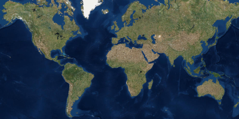

# java-maven-starter-project

Here is a starter project for the ArcGIS Runtime SDK for Java with Maven.

The project includes the Maven wrapper, so there is no need to install Maven to run the app.

The app launches a window displaying a map.

## Instructions

### IntelliJ IDEA

1. Open IntelliJ IDEA and select _File > Open..._.
2. Choose the java-maven-starter-project directory and click _OK_.
3. Select _File > Project Structure..._ and ensure that the Project SDK and language level are set to use Java 11.
4. Open the Maven view with _View > Tool Windows > Maven_.
5. In the Maven view, under _Plugins > dependency_, double-click the `dependency:unpack` goal. This will unpack the native libraries into $USER_HOME/.arcgis.
6. In the Maven view, run the `compile` phase under _Lifecycle_ and then the `exec:java` goal to run the app.

### Eclipse

1. Open Eclipse and select _File > Import_.
2. In the import wizard, choose _Maven > Existing Maven Projects_, then click _Next_.
3. Select the java-maven-starter-project as the project root directory.
4. Click _Finish_ to complete the import.
5. Select _Project > Properties_ . In _Java Build Path_, ensure that under the Libraries tab, _Modulepath_ is set to JRE System Library (JavaSE-11). In _Java Compiler_, ensure that the _Use compliance from execution environment 'JavaSE-11' on the 'Java Build Path'_ checkbox is selected.
6. Right-click the project in the Project Explorer or Package Explorer and choose _Run As > Maven Build..._. In the _Edit Configuration_ dialog, create a new configuration with name `unpack`. In the _Goals_ field, enter `dependency:unpack`. Click _Run_ to run the goal. This will unpack the native libraries into $USER_HOME/.arcgis.
7. Again, create a new run configuration with name `run`. In the _Goals_ field, enter `compile exec:java`. Click _Run_ to run the goal. The app should compile and launch the JavaFX window.

### Command Line

1. `cd` into the project's root directory.
2. Run `./mvnw dependency:unpack` on Linux/Mac or `mvnw.cmd dependency:unpack` on Windows to unpack the native libraries to $USER_HOME/.arcgis.
3. Run `./mvnw compile exec:java` on Linux/Mac or `mvnw.cmd compile exec:java` on Windows to run the app.

## Requirements

See the Runtime SDK's [system requirements](https://developers.arcgis.com/java/latest/guide/system-requirements.htm).

## Resources

* [ArcGIS Runtime SDK for Java](https://developers.arcgis.com/java/)  
* [ArcGIS Blog](https://blogs.esri.com/esri/arcgis/)  
* [Esri Twitter](https://twitter.com/esri)  

## Issues

Find a bug or want to request a new feature?  Please let us know by submitting an issue.

## Contributing

Esri welcomes contributions from anyone and everyone. Please see our [guidelines for contributing](https://github.com/esri/contributing).

## Licensing

Copyright 2019 Esri

Licensed under the Apache License, Version 2.0 (the "License"); you may not 
use this file except in compliance with the License. You may obtain a copy 
of the License at

http://www.apache.org/licenses/LICENSE-2.0

Unless required by applicable law or agreed to in writing, software 
distributed under the License is distributed on an "AS IS" BASIS, WITHOUT 
WARRANTIES OR CONDITIONS OF ANY KIND, either express or implied. See the 
License for the specific language governing permissions and limitations 
under the License.

A copy of the license is available in the repository's license.txt file.
